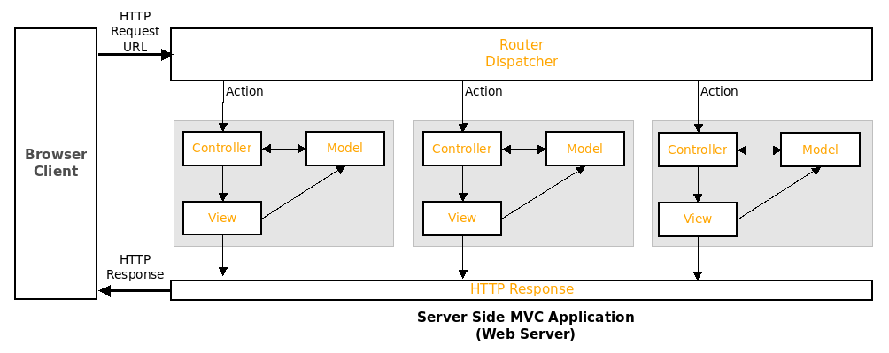

[](https://classroom.github.com/a/v_D1I1ra)
## CS 2033 Web Systems - Assignment Four (S24)



Make the following changes to the provided MVC Framework application.

Run the following script to create your database.
```
sudo mysql < assign4.sql
```

1. **Model:**
   - Implement the **ArticleDAO Model** for the **articles** table. *The DAO should implement all of the CRUD functions for the articles table.*

2. **View:**
   - Implement the View to *display the articles* on the **Home page for viewers to read the articles like on a website (Not a Table)
   - Implement the View (Add Form) to add an article to the articles table.
   
3. **Controller:**
   - Modify the Home Controller to display the articles on the Home page
   - Add the Controller to Add an Article using the view(Add Form)
   - Add the Add Article option to the main menu
   
4. **Security:**
   - Modify your Security Authentication and Authorization Scheme to allow the following roles: **user, admin, and author**
   - The ability to Add a New Article is only available to authenticated users with the **author** role
   - Access to the Users Admin View is restricted to authenticated users with the **amin** role.

Ensure your works properly by accessing your site using accoutns with all of the roles, and cheching that proper security is implemented.

### Assessment Rubric

| Criteria            | Unsatisfactory (0-49) | Needs Improvement (50-69) | Satisfactory (70-89) | Excellent (90-100) |
|---------------------|------------------------|---------------------------|-----------------------|---------------------|
| Model Implementation| - DAO lacks some or all CRUD functions for the articles table. | - DAO implements CRUD functions, but some are incomplete or have errors. | - DAO successfully implements CRUD functions for the articles table. | - DAO implements CRUD functions with proper error handling and efficiency. |
| View Implementation | - View for displaying articles is not implemented or incomplete. | - View for displaying articles is implemented but lacks proper design or functionality. | - View for displaying articles is implemented with proper design and functionality. | - View for displaying articles is well-designed, user-friendly, and responsive. |
|                     | - View for adding articles is not implemented or incomplete. | - View for adding articles is implemented but lacks proper validation or user guidance. | - View for adding articles is implemented with proper validation and user guidance. | - View for adding articles is intuitive, visually appealing, and error-free. |
| Controller          | - Home Controller lacks modification for displaying articles. | - Home Controller displays articles but lacks proper integration or functionality. | - Home Controller successfully displays articles with proper integration and functionality. | - Home Controller is well-organized, efficient, and effectively handles article display. |
|                     | - Controller for adding articles is not implemented or incomplete. | - Controller for adding articles is implemented but lacks proper authentication or authorization. | - Controller for adding articles is implemented with proper authentication and authorization. | - Controller for adding articles is secure, follows best practices, and handles edge cases. |
|                     | - Main menu does not include an option to add articles. | - Main menu includes an option to add articles but lacks proper functionality. | - Main menu includes a functional option to add articles. | - Main menu is well-designed, user-friendly, and integrates seamlessly with the application. |
| Security            | - Security scheme is not modified or lacks implementation. | - Security scheme is modified but lacks proper role-based access control. | - Security scheme successfully implements role-based access control for user, admin, and author roles. | - Security scheme is robust, comprehensive, and effectively restricts access based on roles. |
|                     | - Authentication for adding new articles is not implemented or incomplete. | - Authentication for adding new articles is implemented but lacks proper validation or error handling. | - Authentication for adding new articles is implemented with proper validation and error handling. | - Authentication for adding new articles is seamless, secure, and transparent to users. |
|                     | - Authorization for adding new articles is not implemented or incomplete. | - Authorization for adding new articles is implemented but lacks proper role-based restrictions. | - Authorization for adding new articles is implemented with proper role-based restrictions. | - Authorization for adding new articles is granular, customizable, and enforces strict access control. |

---

## Implementation Notes

A hand-rolled **PHP MVC framework** (no external framework/library — everything under `framework/` is custom) implementing an article-publishing / user-management app with role-based access control, backed by MySQL via `mysqli`.

**Architecture:**
- `start.php` is the single entry point. It registers every controller with a custom `Router` (`framework/Router.php`, extended as `MyRouter`) and dispatches based on the `?action=` query/POST parameter (e.g. `start.php?action=home`, `start.php?action=login`).
- `MyRouter::authCheck()` checks each controller's `getAuth()` (`PUBLIC` by default, overridden per controller) against `$_SESSION['loggedin']`; unauthenticated access to a non-public action renders `restrictedAccess` instead.
- **Controllers** (`controllers/`) — one per action: `Home`, `About`, `Login`/`LogOut`, `UserList`/`UserAdd`/`UserUpdate`/`UserDelete`, `ArticleList`/`ArticleDisplay`/`ArticleAdd`/`ArticleUpdate`/`ArticleDelete`, `RestrictedAccess`.
- **Models/DAOs** (`models/`) — `Article`/`ArticleDAO` and `User`/`UserDAO`. The DAOs run parameterized SQL (`mysqli` prepared statements) implementing full CRUD for both articles and users.
- **Views** (`views/`) and shared **templates** (`template/header.php`, `footer.php`, `template.php`) render the pages.

**Auth/roles:** users have a `urole` of `user`, `admin`, or `author` (see `assign4.sql`). Logging in (`controllers/Login.php`) authenticates against the `users` table and stores the user record in `$_SESSION['loggedin']`. Adding an article (`controllers/ArticleAdd.php`) is restricted to `author`/`admin` roles; the Users admin views are intended to be restricted to `admin` (see each controller's `getAuth()`).

**Database:** `assign4.sql` drops/recreates the `assign4DB` database and the `assign4user` MySQL account (password `mvcpass`), creates `users` and `articles` tables (articles have a `userID` foreign key to users), and seeds ~25 users (various roles, plain-text passwords) and 10 sample articles. All DAOs connect with hardcoded credentials: host `127.0.0.1`, user `assign4user`, password `mvcpass`, database `assign4DB` (see `getConnection()` in `models/ArticleDAO.php` / `models/UserDAO.php`) — there is no separate config file, so to point it at a different DB you edit those two files directly.

### Setup & Run

1. **Create the database** (needs a local MySQL/MariaDB server; `sudo mysql` or any client with privileges to create databases/users):
   ```
   sudo mysql < assign4.sql
   ```
2. **Run the app** with PHP's built-in server (requires the `mysqli` extension) from the project root:
   ```
   php -S localhost:8000
   ```
   Then open `http://localhost:8000/start.php`.

   (Works equally well behind Apache/`php-fpm` pointed at this directory, as long as `mysqli` is enabled.)

3. **Sample logins** (from the seed data in `assign4.sql`): `admin` / `admin123` (admin), `bwilliams` / `pass123` (author), `mjones` / `pass1234` (user).

